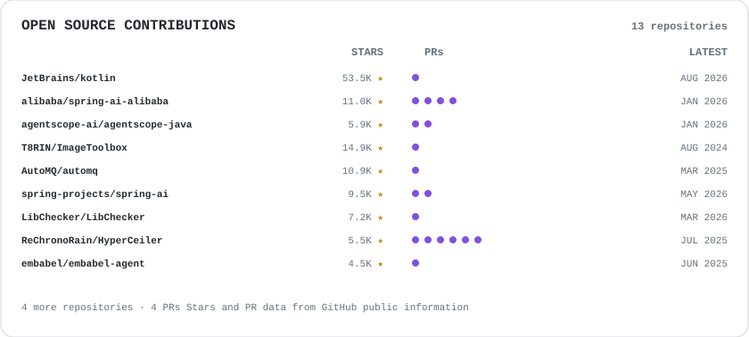

> **Hi there! Welcome to my GitHub profile.**

<h3 align="center">
	
</h3>

## About Me
- Master's student in Computer Science.
- Interested in `Java`, `Kotlin`, `Go`, `Python`, `Infrastructure`, and `Open Source`.
- Building `Agent`, `Infra`, and `Backend Development`.
- Enjoy learning new technologies and building interesting projects.
- Feel free to reach out — I'd love to discuss anything interesting with you!

## Open Source

  <a href="https://github.com/search?q=author%3Agmjneko+-user%3Agmjneko&type=pullrequests">
    <picture>
      <source media="(prefers-color-scheme: dark)" srcset="./assets/open-source-dark.svg">
      <source media="(prefers-color-scheme: light)" srcset="./assets/open-source.svg">
      
    </picture>
  </a>

## GitHub Stats

  <picture>
    <source media="(prefers-color-scheme: dark)" srcset="https://github-readme-stats-pink-nine-60.vercel.app/api?username=gmjneko&show_icons=true&theme=github_dark">
    <source media="(prefers-color-scheme: light)" srcset="https://github-readme-stats-pink-nine-60.vercel.app/api?username=gmjneko&show_icons=true&theme=default">
    
  </picture>
  <picture>
    <source media="(prefers-color-scheme: dark)" srcset="https://github-readme-stats-pink-nine-60.vercel.app/api/top-langs?username=gmjneko&layout=compact&langs_count=8&card_width=350&exclude_repo=gmjneko.github.io,locall&theme=github_dark">
    <source media="(prefers-color-scheme: light)" srcset="https://github-readme-stats-pink-nine-60.vercel.app/api/top-langs?username=gmjneko&layout=compact&langs_count=8&card_width=350&exclude_repo=gmjneko.github.io,locall&theme=default">
    
  </picture>

